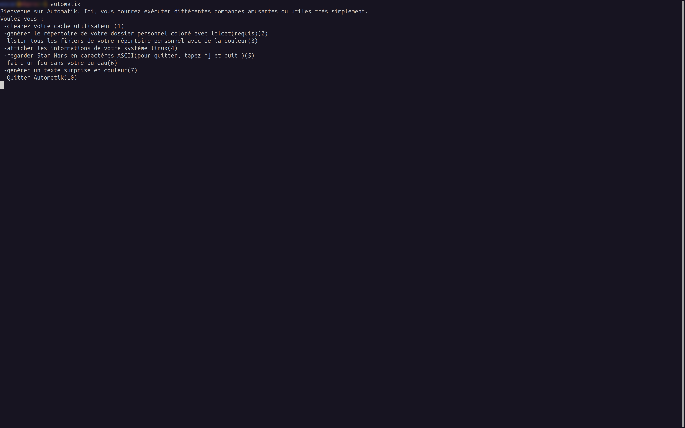

# Automatik 1.0

Automatik est un logiciel permettant d'éxécuter différentes commandes amusantes en shell pour linux.



## Installation 

Automatik se compile et s'éxécute très facilement à partir du script install.sh .
Après avoir téléchargé le dépot Automatik dans votre dossier personnel (/home/utilisateur), ouvrez un terminal(Ctrl+Alt+T) et tapez
```bash
cd Automatik
make
make install
cd ..
```
et Automatik est prêt à vous servir (tapez simplementla commande "automatik" pour lancer le logiciel) !

 

### Dépendances 

* lolcat
* gcc
* bash
* neofetch
* telnet
* rig 
* aafire


**Bonne expérience !!**


